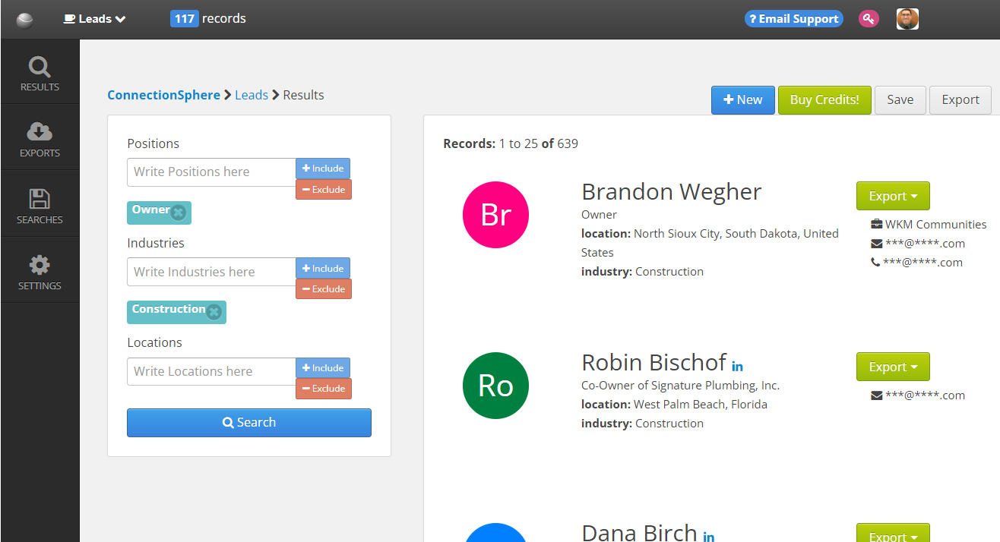

   



# Leads

**Leads** is an extension of [MySaaS](https://github.com/leandrosardi/mysaas) to publish a makeplace of B2B contacts databases.

Find a live example here: [https://ConnectionSphere.com/leads](https://ConnectionSphere.com/leads)

**Outline:**

1. [Getting Started](#1-getting-started).
2. [Merging a New Leads to the Database](#2-merging-a-new-lead-to-the-database).
3. [Merging Many Leads to the Database](#3-merging-many-leads-to-the-database).
4. [Creating Searches](#4-creating-searches).
5. [Retrieving Table Rows](#5-retrieving-table-rows).
6. [Retrieving Leads](#6-retrieving-leads).
7. [Running Offline Export Process](#7-running-offline-export-process).
8. [Disclaimers](#8-disclaimers).

## 1. Getting Started

Follow the steps below to install **Leads** as an extension in your **MySaaS** project 

We are assuming that you have installed your **MySaaS** in your computer, and it is working.
If you have not **MySaaS** working on your computer, follow [this tutorial](https://github.com/leandrosardi/mysaas/blob/main/docu/12.extensibility.md).

If you don't know how do **MySaaS** extensions work, refer to [this article]().

**Step 1:** Access the extensions folder of your **MySaaS** project.

```bash
cd ~/code/mysaas/extensions
```

**Step 2:** Clone the **Leads** project there.

```bash
git clone https://github.com/leandrosardi/leads/
```

**Step 3:** Add the extension in your configuration file

```ruby
# add required extensions
BlackStack::Extensions.append :leads
```

**Step 4:** Setup **Leads** as an [I2P](https://github.com/leandrosardi/i2p) product with plans. _(optional)_

Some screens of the **Leads** extensions are assuming that there is an I2P product called `'leads'`, with some plans defined too.

You should add both product and plans in the `config.rb` of **[MySaaS](https://github.com/leandrosardi/mysaas)**.

Here is a good example:

```ruby
# setup the product
BlackStack::I2P::add_services([
    { 
        :code=>'leads', 
        :name=>'B2B Contacts', 
        :unit_name=>'records', 
        :consumption=>BlackStack::I2P::CONSUMPTION_BY_TIME, 
        # formal description to show in the list of products
        :description=>'B2B Contacts with Emails & Phone Numbers',
        # persuasive description to show in the sales letter
        :title=>'The Best Data Quality, at the Best Price',
        # larger persuasive description to show in the sales letter
        :summary=>'B2B Contacts with verified <b>email addresses</b>, <b>phone numbers</b> and <b>LinkedIn profiles</b>.',
        :thumbnail=>CS_HOME_WEBSITE+'/leads/images/logo.png',
        :return_path=>CS_HOME_WEBSITE+'/leads/results',
        # what is the life time of this product or service?
        :credits_expiration_period => 'month',
        :credits_expiration_units => 1,
        # free tier configuration
        :free_tier=>{
            # add 10 records per month, for free
            :credits=>10,
            :period=>'month',
            :units=>1,
        },
        # most popular plan configuratioon
        :most_popular_plan => 'leads.batman',
    },
])

# setup the plan
BlackStack::I2P::add_plans([
    {
        # which product is this plan belonging
        :service_code=>'leads', 
        # recurrent billing plan or one-time payments
        :type=>BlackStack::I2P::PAYMENT_SUBSCRIPTION,  
        # show this plan in the UI
        :public=>false,
        # is this a One-Time Offer?
        # true: this plan is available only if the account has not any invoice using this plan
        # false: this plan can be purchased many times
        :one_time_offer=>true,  
        # plan description
        :item_number=>'leads.offer', 
        :name=>'90% Off', 
        # trial configuration
        :trial_credits=>280, 
        :trial_fee=>7, 
        :trial_units=>1, 
        :trial_period=>'month',     
        # billing details
        :credits=>28, 
        :normal_fee=>7, # cognitive bias: expensive fee to show it strikethrough, as the normal price. But it's a lie. 
        :fee=>7, # this is the fee that your will charge to the account, as a special offer price.
        :period=>'month',
        :units=>1, # billed monthy
		# Force credits expiration in the moment when the client 
		# renew with a new payment from the same subscription.
		# Activate this option for every allocation service.
		:expiration_on_next_payment => true, # default true
		# Additional period after the billing cycle - Extend 2 weeks after the billing cycle - Referemce: https://github.com/ExpandedVenture/ConnectionSphere/issues/283.
		:expiration_lead_period => 'day', #'M', # default day
		:expiration_lead_units => 365 #3, # default 0
    }, {
        # which product is this plan belonging
        :service_code=>'leads', 
        # recurrent billing plan or one-time payments
        :type=>BlackStack::I2P::PAYMENT_SUBSCRIPTION,  
        # show this plan in the UI
        :public=>true,
        # is this a One-Time Offer?
        # true: this plan is available only if the account has not any invoice using this plan
        # false: this plan can be purchased many times
        :one_time_offer=>false,  
        # plan description
        :item_number=>'leads.robin', 
        :name=>'Robin', 
        # billing details
        :credits=>28, 
        :normal_fee=>7, # cognitive bias: expensive fee to show it strikethrough, as the normal price. But it's a lie. 
        :fee=>7, # this is the fee that your will charge to the account, as a special offer price.
        :period=>'month',
        :units=>1, # billed monthy
		# Force credits expiration in the moment when the client 
		# renew with a new payment from the same subscription.
		# Activate this option for every allocation service.
		:expiration_on_next_payment => true, # default true
		# Additional period after the billing cycle - Extend 2 weeks after the billing cycle - Referemce: https://github.com/ExpandedVenture/ConnectionSphere/issues/283.
		:expiration_lead_period => 'day', #'M', # default day
		:expiration_lead_units => 365 #3, # default 0
    }, {
        # which product is this plan belonging
        :service_code=>'leads', 
        # recurrent billing plan or one-time payments
        :type=>BlackStack::I2P::PAYMENT_SUBSCRIPTION,  
        # show this plan in the UI
        :public=>true,
        # is this a One-Time Offer?
        # true: this plan is available only if the account has not any invoice using this plan
        # false: this plan can be purchased many times
        :one_time_offer=>false,  
        # plan description
        :item_number=>'leads.batman', 
        :name=>'Batman', 
        # billing details
        :credits=>135, 
        :normal_fee=>33, # cognitive bias: expensive fee to show it strikethrough, as the normal price. But it's a lie. 
        :fee=>27, # this is the fee that your will charge to the account, as a special offer price.
        :period=>'month',
        :units=>1, # billed monthy
		# Force credits expiration in the moment when the client 
		# renew with a new payment from the same subscription.
		# Activate this option for every allocation service.
		:expiration_on_next_payment => true, # default true
		# Additional period after the billing cycle - Extend 2 weeks after the billing cycle - Referemce: https://github.com/ExpandedVenture/ConnectionSphere/issues/283.
		:expiration_lead_period => 'day', #'M', # default day
		:expiration_lead_units => 365 #3, # default 0
    }, {
        # which product is this plan belonging
        :service_code=>'leads', 
        # recurrent billing plan or one-time payments
        :type=>BlackStack::I2P::PAYMENT_SUBSCRIPTION,  
        # show this plan in the UI
        :public=>true,
        # is this a One-Time Offer?
        # true: this plan is available only if the account has not any invoice using this plan
        # false: this plan can be purchased many times
        :one_time_offer=>false,  
        # plan description
        :item_number=>'leads.hulk', 
        :name=>'Hulk', 
        # billing details
        :credits=>314, 
        :normal_fee=>79, # cognitive bias: expensive fee to show it strikethrough, as the normal price. But it's a lie. 
        :fee=>47, # this is the fee that your will charge to the account, as a special offer price.
        :period=>'month',
        :units=>1, # billed monthy
		# Force credits expiration in the moment when the client 
		# renew with a new payment from the same subscription.
		# Activate this option for every allocation service.
		:expiration_on_next_payment => true, # default true
		# Additional period after the billing cycle - Extend 2 weeks after the billing cycle - Referemce: https://github.com/ExpandedVenture/ConnectionSphere/issues/283.
		:expiration_lead_period => 'day', #'M', # default day
		:expiration_lead_units => 365 #3, # default 0
    }
])
```

Restart the **MySaaS** webserver in order to get working the new extension.

## 2. Merging a New Lead to the Database

```ruby
o = Leads::FlLead.merge ({
    :name => 'Leandro Sardi',
    :position => 'Founder and CEO',
    :company => {
        :name => "ConnectionSphere",
        :url => "https://connectionsphere.com",
    },
    :industry => "Internet",
    :location => "Argentina",
    :datas => [
        {
            :type => Leads::FlData::TYPE_PHONE,
            :value => "+54 9 11 5555-5555",
        },
        {
            :type => Leads::FlData::TYPE_EMAIL,
            :value => "leandro.sardi@expandedventure.com",
        },
        {
            :type => Leads::FlData::TYPE_EMAIL,
            :value => "tickets@expandedventure.com",
        },
    ],
})

o.save
```


## 3. Merging Many Leads to the Database

```ruby
h = {
'leads' => [
    {
        'name' => 'Leandro Sardi',
        'position' => 'Founder and CEO',
        'company' => {
            'name' => "ConnectionSphere",
#            'url' => "https://connectionsphere.com",
        },
        'industry' => "Internet",
        'location' => "Argentina",
        'datas' => [
            {
                'type' => 10,
                'value' => "+54 9 11 5555-5555",
            },
            {
                'type' => 20,
                'value' => "support@expandedventure.com",
            },
        ],
    }, {
        'name' => 'Juan Pablo Sardi',
        'position' => 'CTO',
        'company' => {
            'name' => "ConnectionSphere",
#            'url' => "https://freeleadsdata.com",
        },
        'industry' => "Internet",
        'location' => "Argentina",
        'datas' => [
            {
                'type' => 10,
                'value' => "+54 9 11 5555-5555",
            },
            {
                'type' => 20,
                'value' => "freeleads@expandedventure.com",
            },
        ],
    }, {
        'name' => 'Maria Sardi',
        'position' => 'CFO',
        'company' => {
            'name' => "ConnectionSphere",
            'url' => "https://freeleadsdata.com",
        },
        'industry' => "Internet",
        'location' => "Argentina",
        'datas' => [
            {
                'type' => 10,
                'value' => "+54 9 11 5555-5555",
            },
            {
                'type' => 20,
                'value' => "cfo@expandedventure.com",
            },
        ],
    },
]}

puts Leads::FlLead.merge_many(h).each { |o| o.save }
```

## 4. Creating Searches

```ruby
o = Leads::FlSearch.new ({
    'name' => 'New first search',
    'description' => 'Looking for Financial Advisors in New York, except New York City',
    'id_user' => BlackStack::MySaaS::User.first.id,
    'saved' => false,
    'no_of_results' => 14,
    'no_of_companies' => 10,
    'positions' => [ 
        { 'value' => 'Financial Advisor', 'positive' => true },
        { 'value' => 'Financial Analyst', 'positive' => true },
        { 'value' => 'Financial Manager', 'positive' => true },
        { 'value' => 'Secretary', 'positive' => false },
        { 'value' => 'Student', 'positive' => false },
    ],
    'locations' => [
        { 'value' => 'New York', 'positive' => true },
        { 'value' => 'New York City', 'positive' => false },
    ],
    'industries' => [
        { 'name' => 'Financial Services', 'positive' => true },
        { 'name' => 'Management Consulting', 'positive' => false },
    ],
})

o.save
```

## 5. Retrieving Table Rows

```ruby
s = Leads::FlSearch.new ({
    'name' => 'New first search',
    'description' => 'Looking for Financial Advisors in New York, except New York City',
    'id_user' => BlackStack::MySaaS::User.first.id,
    'saved' => false,
    'no_of_results' => 14,
    'no_of_companies' => 10,
    'positions' => [ 
        { 'value' => 'Financial Advisor', 'positive' => true },
        { 'value' => 'Financial Analyst', 'positive' => true },
        { 'value' => 'Financial Manager', 'positive' => true },
        { 'value' => 'Secretary', 'positive' => false },
        { 'value' => 'Student', 'positive' => false },
    ],
    'locations' => [
        { 'value' => 'New York', 'positive' => true },
        { 'value' => 'New York City', 'positive' => false },
    ],
    'industries' => [
        { 'name' => 'Financial Services', 'positive' => true },
        { 'name' => 'Management Consulting', 'positive' => false },
    ],
})

puts s.rows({
    'page' => 1,
    'pagesize' => 25,
    'sortcolumn' => 'name',
    'sortorder' => 'asc',
})
```

## 6. Retrieving Leads

```ruby
s = Leads::FlSearch.new ({
    'name' => 'New first search',
    'description' => 'Looking for Financial Advisors in New York, except New York City',
    'id_user' => BlackStack::MySaaS::User.first.id,
    'saved' => false,
    'no_of_results' => 14,
    'no_of_companies' => 10,
    'positions' => [ 
        { 'value' => 'Financial Advisor', 'positive' => true },
        { 'value' => 'Financial Analyst', 'positive' => true },
        { 'value' => 'Financial Manager', 'positive' => true },
        { 'value' => 'Secretary', 'positive' => false },
        { 'value' => 'Student', 'positive' => false },
    ],
    'locations' => [
        { 'value' => 'New York', 'positive' => true },
        { 'value' => 'New York City', 'positive' => false },
    ],
    'industries' => [
        { 'name' => 'Financial Services', 'positive' => true },
        { 'name' => 'Management Consulting', 'positive' => false },
    ],
})

puts s.leads({
    'page' => 1,
    'pagesize' => 25,
    'sortcolumn' => 'name',
    'sortorder' => 'asc',
})
```

## 7. Running Offline Export Process

It is pending to add the starting of this offline job to the deployer.
Meanwhile, you can start this by running the command below.

```bash
cd ~/code/mysaas/extensions/leads/p
nohup ruby export.rb &
```

## 8. Disclaimers

This project is still under construction.

The logo has been taken from [here](https://www.shareicon.net/shot-shooting-target-circular-target-targeting-target-interface-duck-700809).

